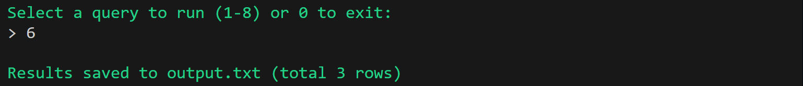
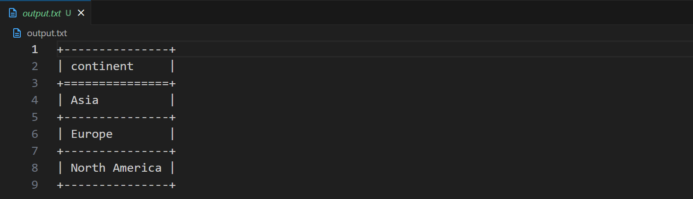

  


# COVID-19 Analytics 🧬  

📊 A data analysis project using MySQL.  

---

## Table of Contents  

1. [About](#about)  
2. [Features](#features)  
3. [Requirements](#requirements)  
4. [Installation](#installation)  
5. [Usage](#usage)  

---

## About  

This repository contains a collection of SQL queries for analyzing COVID-19 datasets.   
The project demonstrates data manipulation, aggregation, and filtering techniques using MySQL.

---

## Features

- Query menu to navigate between different SQL queries:
  1. **Q1:** Difference between the total cases in February (across all years) and in March (Feb-March).  
  2. **Q2:** Matching new_cases (>1000) for two different locations on the same date (first 1000 rows).  
  3. **Q3:** Average number of new tests on days where the positive rate is above average.  
  4. **Q4:** Dates in Asia with more than 20M new vaccinations.  
  5. **Q5:** Total new cases for locations with the highest population per date, only if average new cases > 3.  
  6. **Q6:** Continents with total new_cases greater than the average (excluding locations starting with 'A').  
  7. **Q7:** Monthly statistics (average, max, min) of new cases for each location.  
  8. **Q8:** Continents where average new_cases is higher than average of locations with below-average population.

- Results from all queries are saved to an external file (`output.txt`).

---

## Requirements

To run this project locally, you’ll need:

- **Docker** – to run the MySQL server in a container.  
- **MySQL image** – the Docker image for MySQL (for example: `mysql:8.0`).  
- **Python 3** – to run the query scripts (`run_queries.py` and `q1`-`q8`).  
- **Python packages:**  
  - `mysql-connector-python` – to connect Python to MySQL.  
  - `tabulate` – to nicely print tables in the console.  
- **Git** – for version control and cloning the repository.  

---

## Installation  

Follow these steps to set up the project locally:

### 1. Clone the repository
```bash
git clone https://github.com/Amit-Bruhim/covid19-analytics.git
```

```bash
cd covid19-analytics/data
```

### 2. Start Docker engine
Make sure Docker Desktop is running.

### 3. Create and run MySQL container
```bash
docker run -p 3307:3306 --name mysql_env -e MYSQL_ROOT_PASSWORD=root -d mysql/mysql-server:5.7
```

### 4. Access the container’s terminal
```bash
docker exec -it mysql_env bash
```

### 5. Open the MySql CLI
```bash
mysql -uroot -p
```
And enter the password `root`.

### 6. Allow root access from your machine
```bash
update mysql.user set host='%' where user='root';
flush privileges;
```

### 7. Install Python dependencies 

exit the MySQL CLI and the container, and go back to your regular terminal (PowerShell / CMD) in the project folder:

```bash
pip install mysql-connector-python tabulate
```

### 8. Format the date columns

Before importing the CSV files into the database, make sure the `date` columns are in proper date

1. Open each CSV file (`covid_deaths.csv` and `covid_vaccination.csv`) in Excel.
2. Select the `date` column.
3. Right-click and choose **Format Cells**.
4. In the **Number** tab, select **Date** and set the format to: `yyyy-mm-dd`. 
5. Save the CSV files.

### 9. Copy the csv files into the container

```bash
docker cp covid_deaths.csv mysql_env:covid_deaths.csv
docker cp covid_vaccination.csv mysql_env:covid_vaccination.csv
```

### 10. Create the database:
Open the MySQL CLI and run the following commands:
#### 10.1 Create the database
```bash
create database covid_db;
```
#### 10.2 Create the tables
```bash
CREATE TABLE covid_db.covid_deaths (
iso_code TEXT,
continent TEXT,
location TEXT,
date TEXT,
population BIGINT,
total_cases BIGINT,
new_cases BIGINT,
new_cases_smoothed FLOAT,
total_deaths BIGINT,
new_deaths BIGINT,
new_deaths_smoothed FLOAT,
total_cases_per_million BIGINT,
new_cases_per_million BIGINT,
new_cases_smoothed_per_million BIGINT,
total_deaths_per_million BIGINT,
new_deaths_per_million BIGINT,
new_deaths_smoothed_per_million FLOAT,
reproduction_rate BIGINT,
icu_patients BIGINT,
icu_patients_per_million BIGINT,
hosp_patients BIGINT,
hosp_patients_per_million BIGINT,
weekly_icu_admissions BIGINT,
weekly_icu_admissions_per_million BIGINT,
weekly_hosp_admissions BIGINT,
weekly_hosp_admissions_per_million BIGINT
);
```
```bash
CREATE TABLE covid_db.covid_vaccination (
iso_code TEXT,
continent TEXT,
location TEXT,
date TEXT,
new_tests BIGINT,
total_tests BIGINT,
total_tests_per_thousand BIGINT,
new_tests_per_thousand BIGINT,
new_tests_smoothed BIGINT,
new_tests_smoothed_per_thousand FLOAT,
positive_rate FLOAT,
tests_per_case FLOAT,
tests_units BIGINT,
total_vaccinations BIGINT,
people_vaccinated BIGINT,
people_fully_vaccinated BIGINT,
new_vaccinations BIGINT,
new_vaccinations_smoothed BIGINT,
total_vaccinations_per_hundred FLOAT,
people_vaccinated_per_hundred FLOAT,
people_fully_vaccinated_per_hundred FLOAT,
new_vaccinations_smoothed_per_million BIGINT,
stringency_index FLOAT,
population_density FLOAT,
median_age FLOAT,
aged_65_older FLOAT,
aged_70_older FLOAT,
gdp_per_capita FLOAT,
extreme_poverty FLOAT,
cardiovasc_death_rate FLOAT,
diabetes_prevalence FLOAT,
female_smokers FLOAT,
male_smokers FLOAT,
handwashing_facilities FLOAT,
hospital_beds_per_thousand FLOAT,
life_expectancy FLOAT,
human_development_index FLOAT,
excess_mortality FLOAT
);
```
#### 10.3 Import the CSV data
```bash
LOAD DATA LOCAL INFILE 'covid_deaths.csv' INTO TABLE covid_db.covid_deaths CHARACTER
SET UTF8 FIELDS TERMINATED BY ',' ENCLOSED BY '"' LINES TERMINATED BY '\r\n' IGNORE 1
LINES;
```
```bash
LOAD DATA LOCAL INFILE 'covid_vaccination.csv' INTO TABLE covid_db.covid_vaccination
CHARACTER SET UTF8 FIELDS TERMINATED BY ',' ENCLOSED BY '"' LINES TERMINATED BY
'\r\n' IGNORE 1 LINES;
```

### 11. Fix the date column in MySQL
Open the MySQL CLI and run the following commands:

#### 11.1 Switch to the database
```sql
USE covid_db;
```

#### 11.2 Fixing and Standardizing Date Formats
```sql
ALTER TABLE covid_deaths ADD COLUMN date_fixed DATE;

SET SQL_SAFE_UPDATES = 0;

UPDATE covid_deaths
SET date_fixed = CASE
    WHEN CHAR_LENGTH(date) = 10 AND SUBSTRING(date,5,1) = '-'
        THEN STR_TO_DATE(date, '%Y-%m-%d')
    ELSE STR_TO_DATE(date, '%d/%m/%Y')
END;

SET SQL_SAFE_UPDATES = 1;

ALTER TABLE covid_deaths DROP COLUMN date;
ALTER TABLE covid_deaths CHANGE COLUMN date_fixed date DATE;

ALTER TABLE covid_vaccination ADD COLUMN date_fixed DATE;

SET SQL_SAFE_UPDATES = 0;

UPDATE covid_vaccination
SET date_fixed = CASE
    WHEN CHAR_LENGTH(date) = 10 AND SUBSTRING(date,5,1) = '-'
        THEN STR_TO_DATE(date, '%Y-%m-%d')
    ELSE STR_TO_DATE(date, '%d/%m/%Y')
END;

SET SQL_SAFE_UPDATES = 1;

ALTER TABLE covid_vaccination DROP COLUMN date;
ALTER TABLE covid_vaccination CHANGE COLUMN date_fixed date DATE;
```

### 12. Run the Project 🚀

```bash
cd src
python run_queries.py 
```

---

## Usage

After running the project, the following prompt will appear:


To interact with the program:

- Enter the number corresponding to a query (1-8) to run it.
- Enter `0` to exit the program.
- If you enter a number that doesn't exist in the menu, an error message will be displayed.

For example, selecting option `6` from the menu will lead to:




The query results are written to the `output.txt` file in the root folder.
